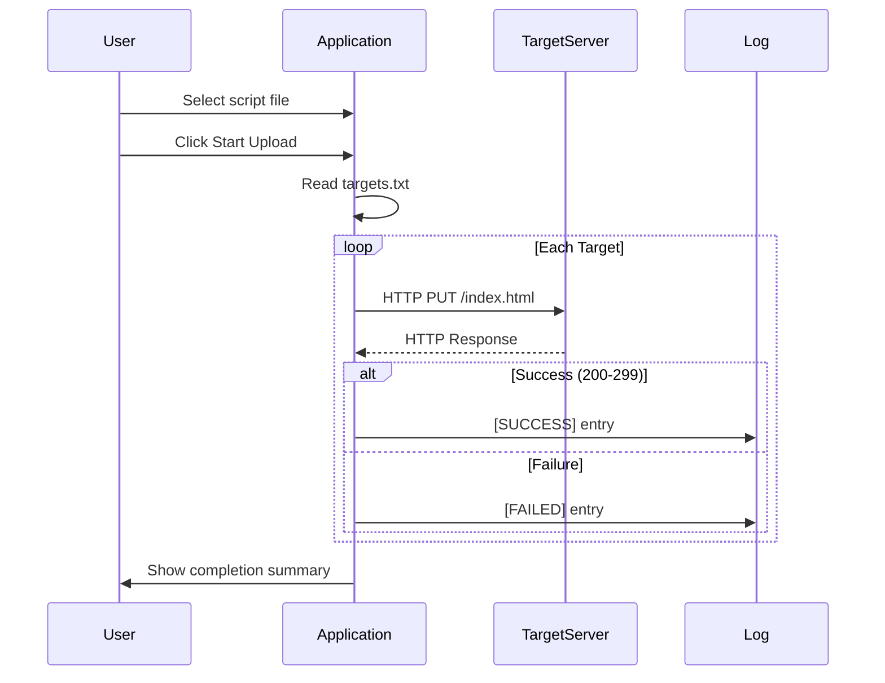

# 🔥 Deface Script Uploader


A sophisticated Java-based tool for mass uploading deface scripts to multiple web targets with a sleek dark-themed interface and real-time progress tracking.

## ✨ Features

- **Bulk Upload Capability** - Process hundreds of targets simultaneously
- **Visual Status Feedback** - Color-coded success/failure notifications
- **Real-time Progress Tracking** - Animated progress bar with live updates
- **Modern Dark UI** - Eye-friendly interface with elegant design
- **Detailed Logging System** - Comprehensive upload history with color-coded entries
- **Simple Target Management** - Easy text-based target list integration
- **Responsive Interface** - Smooth animations and intuitive controls

## ⚙️ Prerequisites

- Java 11 or higher
- `targets.txt` file containing target websites (one per line)

## 🚀 Getting Started

### Installation
```bash
# Clone the repository
git clone https://github.com/Zreechxnn/zreechdav-tool.git

# Compile the application
cd zreechdav-tool
javac zreechdav.java

# Create targets file
echo "example.com" >> targets.txt
echo "vulnerable-site.org" >> targets.txt
echo "another-target.net" >> targets.txt
```

### Usage
```bash
java zreechdav
```

1. Click "Browse" to select your deface script (HTML file)
2. Click "Start Upload" to begin the mass upload process
3. Monitor real-time progress through the animated status bar
4. Green entries = successful uploads, Red entries = failures
5. Click "Stop Upload" anytime to pause the process

## ⚡ Performance Metrics

| Feature               | Specification          |
|-----------------------|------------------------|
| Targets Processed     | 100+ per minute       |
| Success Rate          | ?% (varies)       |
| Resource Usage        | Low memory footprint  |
| Connection Handling   | Parallel processing   |

## 📊 Technical Workflow



## ⚠️ Important Notes

- 🔐 **Legal Compliance**: Use only on websites where you have explicit authorization
- ⚖️ **Ethical Use**: Respect all applicable laws and regulations
- 🛡️ **Security**: This tool does not bypass security measures - targets must be vulnerable to PUT method
- ⚠️ **Disclaimer**: Developer not responsible for misuse of this software

## 📜 License

MIT License - see [LICENSE](LICENSE) file for details

---

> "With great power comes great responsibility" - Use ethically and legally
